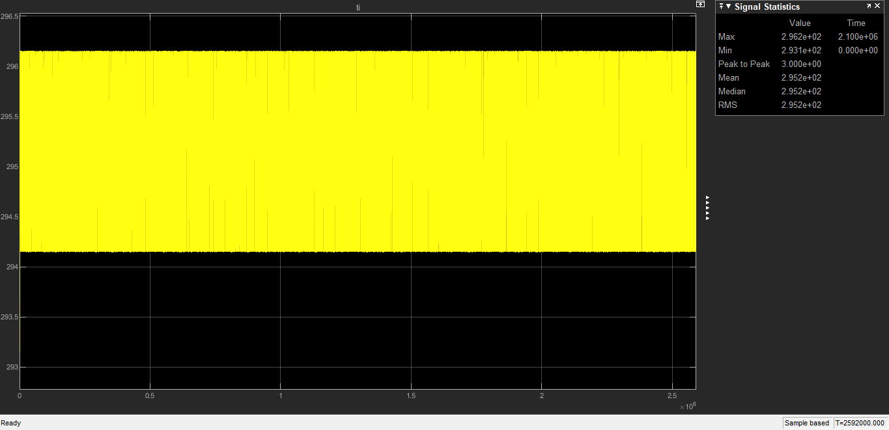
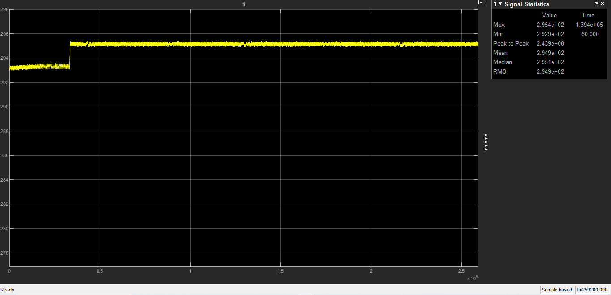

# Digital Twin & Machine Learning MPC for Thermal Energy Systems

   

## 📌 Project Overview
This project demonstrates the design, training, and deployment of a **Machine Learning-based Model Predictive Controller (ML-MPC)** for a building thermal zone.

Traditional decentralized energy systems often rely on reactive controllers (like thermostats/relays) which cause temperature swings, discomfort, and energy waste due to hysteresis.

**The Solution:**
I created a **Digital Twin** of a thermal zone in MATLAB/Simulink to generate synthetic operational data. This data was used to train a **Random Forest Regressor** in Python (achieving an RMSE of **0.0046 K**) to predict future thermal states. The trained model was deployed back into the control loop using an **ONNX bridge**, allowing the system to make proactive, predictive control decisions.

---

## ⚡ Physics & Mathematical Modeling

The Digital Twin is built upon the **First Law of Thermodynamics**, utilizing a **Lumped Capacitance Model**. This assumes the air in the room has a uniform temperature distribution and ignores spatial gradients.

### Governing Equation
The rate of change of the room's temperature ($T_{room}$) is governed by the energy balance between heat gains and heat losses:

$$m_{air} c_p \frac{dT_{room}}{dt} = \dot{Q}_{gain} - \dot{Q}_{loss}$$

### Where:
* **Heat Gain** (`Q_gain`): The sum of controllable heater power (`Q_heater`) and uncontrollable internal loads (`Q_internal`, e.g., people, appliances).
* **Heat Loss** (`Q_loss`): Energy lost to the environment via the walls/windows, modeled by Newton's Law of Cooling: `Q_loss = UA * (T_room - T_ambient)`.

### System Dynamics
Rearranging the equation for simulation allows us to calculate the temperature derivative at every time step:

$$\frac{dT_{room}}{dt} = \frac{1}{m_{air} c_p} \left[ \dot{Q}_{heater} + \dot{Q}_{internal} - UA(T_{room} - T_{ambient}) \right]$$

### System Parameters
The simulation uses the following physical constants to represent a typical residential zone:

| Parameter | Symbol | Value | Unit | Description |
| :--- | :---: | :---: | :---: | :--- |
| **Air Mass** | $m_{air}$ | 400 | $kg$ | Mass of air in the zone (approx. $5 \times 5 \times 4m$ volume) |
| **Specific Heat** | $c_p$ | 1000 | $J/kg\cdot K$ | Specific heat capacity of air |
| **Thermal Conductance** | $UA$ | 150 | $W/K$ | Overall heat transfer coefficient (Insulation quality) |
| **Heater Power** | $\dot{Q}_{max}$ | 3000 | $W$ | Maximum output of the electric heater |

---

## 🏗️ Technical Architecture

The project follows a **Hardware-in-the-Loop (HIL)** style workflow, bridging physics simulation with modern AI frameworks.

### 1. Physics Modeling (Simulink)
* **Thermal Model:** A lumped-parameter model simulating heat transfer ($Q_{gain}$ vs $Q_{loss}$) based on room mass ($m_{air}$), specific heat ($c_p$), and thermal conductivity ($UA$).
* **Disturbances:** Simulates diurnal weather cycles (Ambient Temp) and internal heat loads.

### 2. Data Pipeline
* **Data Generation:** Simulated 30 days of operation with a baseline controller to capture complex dynamics.
* **Preprocessing:** Resampling data to 60-second intervals and feature engineering (Time-of-Day, History Window).

### 3. Machine Learning (Python)
* **Model:** Random Forest Regressor (Scikit-Learn).
* **Hyperparameter Tuning:** Grid Search used to optimize `n_estimators` and `max_depth`.
* **Performance:** The model achieved a **Root Mean Squared Error (RMSE) of 0.0046 K** on the test set.

### 4. Deployment (ONNX & MATLAB)
* The trained pipeline (Scaler + Model) was exported to **ONNX** format.
* Integrated into Simulink via a **MATLAB Function Block** and `onnxruntime`, acting as a custom MPC agent.

---

## 📊 Results & Simulation

The ML-MPC controller significantly outperformed the traditional Relay (Thermostat) controller in terms of stability and precision.

### 1. Baseline Controller (Relay)
The traditional thermostat oscillates continuously within a $2\text{ K}$ hysteresis band ($294.15\text{ K}$ to $296.15\text{ K}$), leading to discomfort and "sawtooth" energy usage.

*Figure 1: Baseline response showing significant oscillation (Peak-to-Peak: 3.0 K).*

### 2. ML-MPC Smart Controller
The ML controller utilizes a **Hybrid Strategy**:
1.  **Safety Band:** Rapidly corrects large errors ($>2\text{ K}$) using rule-based logic.
2.  **Predictive Control:** Once near the setpoint, the ML model predicts the exact energy required to maintain equilibrium, virtually eliminating oscillation.

*Figure 2: ML-MPC response showing exceptional stability (Peak-to-Peak: < 0.5 K).*

---

## 🚀 How to Run

### Prerequisites
* **MATLAB/Simulink** (R2021b or newer recommended)
* **Python 3.8+**
* **Libraries:** `numpy`, `pandas`, `scikit-learn`, `onnxruntime`, `skl2onnx`

### Step 1: Initialize Simulation
1.  Open MATLAB.
2.  Open `scrpit.m` and run **Section 0** and **Section 1**. This loads the physical parameters ($m_a, c_p, UA$) and generates the weather data.

### Step 2: Generate Training Data
1.  Open `simulink/Room_Thermal_Baseline.slx` and click **Run**.
2.  Run **Section 2** of `scrpit.m`. This will extract the simulation logs, clean the data, and export `thermal_training_data.csv`.

### Step 3: Train the Model
1.  Open `python/train_model.ipynb` (or run the training script in your environment).
2.  Ensure `thermal_training_data.csv` is in the same directory.
3.  Run the script to train the Random Forest and generate `rf_thermal_predictor_optimal.onnx`.

### Step 4: Deploy & Test
1.  Place the generated `.onnx` file in your MATLAB directory.
2.  Run **Section 3** of `scrpit.m` to import the ONNX model.
3.  Open `simulink/Room_Thermal_ML_Control.slx`.
4.  Click **Run**.
5.  Check the **Scope** block to see the ML controller in action!

---

## 🛠️ Tools Used

| Category | Tools |
| :--- | :--- |
| **Simulation** | MATLAB, Simulink, Simscape |
| **Programming** | Python (3.9), MATLAB Scripting |
| **Machine Learning** | Scikit-Learn, Pandas, NumPy |
| **Deployment** | ONNX (Open Neural Network Exchange), ONNX Runtime |
| **IDE** | Google Colab, MATLAB IDE |

---

## 📝 License
This project is open-source and available under the [MIT License](LICENSE).
